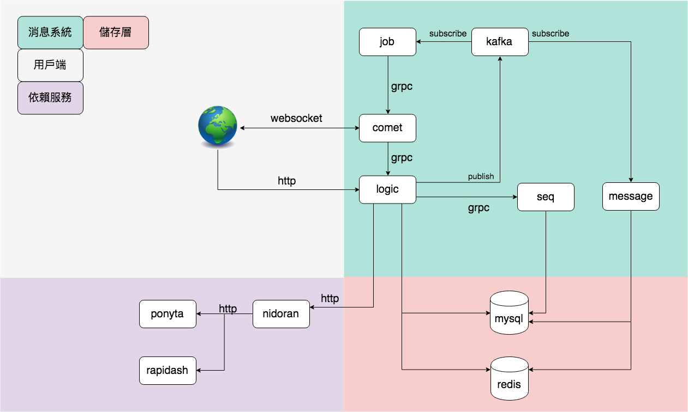

# 聊天室
- [快速開始使用服務](#quick-reference)
- [快速建置聊天室服務](#quick-start)
  - [編譯](#build)
  - [運行](#run)
- [依賴工具](#dependencies)
- [架構圖](#architecture)
- [聊天室Web Socket協定](#protocol-body)
- [Web Socket](#web-socket)
- [會員身份權限](#member-permissions)
- [訊息規則](#message-rule)
- [錯誤訊息](#system-message)
- [聊天室版本](#tag)
- [Q&A](#q-and-a)

## Quick Start

### Build
```
    make build
```

### Run
```
    make run
    make stop
```

## Dependencies
[Redis](#)

[Kafka](https://kafka.apache.org/quickstart)

    cd kafka
    docker-compose up -d
    
## Architecture




`comet` : 負責管理web端連線與將訊息推送給web

`logic` : 負責接收各種商業邏輯訊息推送

`job` : 負責告知comet要推送什麼訊息以及房間訊息聚合

## Quick Reference

前台：
1. 如何跟進入聊天室 [答案](#room)
2. 如何知道進入聊天室有沒有成功 `答案:失敗會直接close連線，成功請`[看](#response)
3. 如何在聊天室發訊息 [前台訊息推送](https://jetfueltw.postman.co/collections/6851408-6a660dbe-4cc3-4c3e-94b5-897071b2802b?workspace=56a5a88a-bfd1-46b5-8102-a2ca97183649)
4. 如何接收聊天室訊息
5. 如何知道被禁言
6. 如何知道被封鎖
7. 如何在聊天室發紅包
8. 如何搶紅包
9. 如何在聊天室發跟注
10. 如何跟注
11. 如何切換聊天室房間
12. 如何拿到歷史紀錄
13. 如何知道會員現在可不可以發紅包,跟注等權限操作
14. 如何跟聊天室做心跳 [答案](#heartbeat)
15. 聊天室心跳週期是多少 `答案:每分鐘心跳一次`
16. 如何產生一個跟websocket溝通的Protocol [答案](#buffer)

後台：
1. 如何以管理員身份廣播多個聊天室
2. 如何以系統公告身份廣播多個聊天室
3. 如何得到線上所有聊天室清單與在線人數
4. 如何得到某聊天室歷史紀錄
5. 如何禁言某會員
6. 如何封鎖某會員
7. 如何解禁言某會員
8. 如何解封鎖某會員
9. 如何在聊天室發紅包
10. 如何在聊天室發跟注
11. 如何將訊息置頂
12. 如何得到禁言名單
13. 如何得到封鎖名單
14. 如何得到某聊天室名單
15. 如何設定聊天設定(比如充值多少才能聊天)

## Protocol Body格式

採用websocket做binary傳輸，聊天室推給client訊息內容如下格式

name | length | remork |說明
-----|--------|--------|-----
Package|4 bytes|header + body length| 整個Protocol bytes長度
Header|2 bytes|protocol header length| Package  - Boyd 
Operation|4 bytes| [Operation](#operation)|Protocol的動作
Body |不固定|傳送的資料16bytes之後就是Body|json格式


### Package
用於表示本次傳輸的binary內容總長度是多少(header + body)

### Header
用來說明Protocol Header binary 長度是多少

### Operation
不同的Operation說明本次Protocol資料是什麼，如心跳回覆,訊息等等

value | 說明 |
-----|-----|
1|要求連線到某一個房間
2|連線到某一個房間結果回覆
3|發送心跳
4|回覆心跳結果
5|聊天室訊息
6|更換房間
7|回覆更換房間結果

### Body
聊天室的訊息內容

###  Buffer
如何在前端產生一個Protocol Body，以進入聊天室為例子
> 本例子js只是解釋如何產生一個Protocol，實際寫法請自行實作

```
// websocket傳輸模式要設定成binary
ws.binaryType = 'arraybuffer'

// 準備好body內容
var token = '{"token":"efk350dmdh20kdf", "room_id":"123"}'

// 一個長度為10的ArrayBuffer，因為如何在前端產生一個Protocol Header長度為10
// 請看本章解上圖4+2+4 = 10
var headerBuf = new ArrayBuffer(10)

// 產生一個用於header DataView
var headerView = new DataView(headerBuf, 0)

// encoder body
var bodyBuf = textEncoder.encode(token)

// 根據set Protocol Package欄位內容，原因請看本章解上述Package解釋
// 從第0個byte開始放資料，由於是in32所以會佔4byte
headerView.setInt32(0, 10 + bodyBuf.byteLength)

// 根據set Protocol Header欄位內容，原因請看本章解上述Header解釋
// 從第4個byte開始放資料，由於是int16所以會佔2byte
headerView.setInt16(4, rawHeaderLen)

// 根據set Protocol Operation欄位內容，原因請看本章解上述Operation解釋
// 從第6個byte開始放資料，由於是int32所以會佔4byte
// 參數1代表此Protocol表示進入某房間
headerView.setInt32(6, 1)

// 將headerView與bodyBuf兩個轉成Uint8Array在做合併
var u81 = new Uint8Array(headerBuf)
var u82 = new Uint8Array(bodyBuf)
res = new Uint8Array(headerBuf.byteLength + bodyBuf.byteLength)
res.set(u81, 0)
res.set(u82, headerBuf.byteLength)

// 輸出成binary傳給websocket
ws.send(res.buffer)
```

接收到回覆

```
ws.onmessage = function (evt) {
	var data = evt.data
	var dataView = new DataView(data, 0)
	
    // Protocol Package欄位內容
	var packetLen = dataView.getInt32(0)
	
    // Protocol Header欄位內容
	var headerLen = dataView.getInt16(4)
	
    // Protocol Operation欄位內容
	var op = dataView.getInt32(6)
    
	switch (op) {
   	    // 回覆進入房間結果
		case 2:
  		    // 擷取出body內容
			var json = textDecoder.decode(data.slice(headerLen, packetLen))
			var msgBody = JSON.parse(json)
			console.log(msgBody)
			break
		// 回覆心跳結果，心跳body為空所以不做事	
		case 4:
			console.log("receive: heartbeat")
			break
	}
}
```

### Response

Operation = `2`=> 連線到某一個房間結果回覆Body

```
{
    "uid": "12333122112",
    "key": "0693bade-cee5-4e74-ae0d-e526d7e0f3fe"
}
```
name|說明|
----|-----|
uid|user uid，發送訊息會用到
key|這次web socket連線id，發送訊息會用到

Operation = `4`=> 回覆心跳結果
```
body是空的，有收到Operation = 4 就是成功
```

## Web Socket

### room

跟websocket建立完連線後將以下json包裝成[Protocol](#protocol-body)發送至websocket，Protocol Operation[參考](#operation)

```
  {
      "token": "gM18QgsqI0zFFmdLyvHQxKa0N95BRZSh",
      "room_id": 123
  }
```
name|說明|
----|-----|
token|認證中心發行的token，在paras的jwt claims內
room_id|想要進入的房間id，透過paras取得

結果|說明|
----|-----|
成功|[Response](#response)
失敗|server會把websocket close

### heartbeat
進入房間成功後websocket需要每分鐘做一次心跳，讓server確保websocket健康狀況，請利用送一個body為空的[Protocol](#protocol-body)，以下是一個簡單的js範例，至於為什麼這樣寫[請看](#buffer)

```
var headerBuf = new ArrayBuffer(rawHeaderLen);
var headerView = new DataView(headerBuf, 0);
headerView.setInt32(packetOffset, rawHeaderLen);
headerView.setInt16(headerOffset, rawHeaderLen);
headerView.setInt32(opOffset, 3);
```

結果|說明|
----|-----|
成功|[Response](#response)
失敗|不會怎樣，但在最後期限心跳失敗就會close連線

## Member Permissions
會員權限與身份
狀態 |進入聊天室 |查看聊天 | 聊天 |發紅包|搶紅包|跟注|發跟注|
-----|-----|-----|-----|-----|-----|-----|-----|
禁言|yes|yes|no|yes|yes|yes|no|
封鎖|no|no|no|no|no|no|no|

身份 |進入聊天室 |查看聊天 | 聊天 |發紅包|搶紅包|跟注|發跟注|訊息置頂|充值限制聊天|打碼量聊天|
-----|-----|-----|-----|-----|-----|-----|-----|-----|-----|-----|
帶玩帳號|yes|yes|yes|yes|yes|yes|yes|no|
一般帳號|yes|yes|yes|yes|yes|yes|yes|no|
試玩帳號|yes|yes|no|no|no|no|no|no|
假人|no|no|no|no|no|no|yes|no|
後台|no|no|yes|yes|no|no|no|yes|
未登入|no|no|no|no|no|no|no|no|

> 帶玩帳號,後台,假人都不算帳

## Message Rule
訊息內容

  - 名稱
  - 頭像
  - 訊息
  - 發送時間

訊息種類

- 會員
- 管理員
- 發紅包
- 搶紅包
- 系統公告

歷史訊息，以10分鐘當1個區段，回滑能看到1小時訊息為止，以下是訊息種類

- 會員
- 管理員
- 發紅包
- 搶紅包


系統自動禁言10分鐘or永久禁言：
  - 不雅訊息1次
  - 10秒內相同訊息3次
  - 自動禁言達5次會永久禁言
  - 只限定`一般帳號`會有此功能

能訊息頂置身份
  - 管理原

發送訊息限制
  - 下限1字元
  - 上限100字元
  - 1秒1則

## System Message
異常狀況| 訊息
-----|-----
未登入|请先登入会员
試玩發言|请先登入会员
試玩搶紅包|请先登入会员
試玩發紅包|请先登入会员
後台執行禁言|[会员名称] 被禁言
後台執行封鎖|[会员名称] 被封鎖
被禁言者發言|您在禁言状态，无法发言
不符後台條件發言|您无法发言，当前发言条件：前两天充值不少于[  ]元；打码量不少于[  ]元

## Tag
tag|說明|
---|----|
v0.1.0|config改為yml
v0.1.1|移除Discovery
v0.1.2|module更名
v0.1.3|module移除沒用到的package
v0.2.0|更改protobuf目錄結構
v0.3.0|protobuf移除不必要參數與method
v0.4.0|移除有關於Operation推送限制
v0.5.0|移除room type推送限制
v0.6.0|refactor log or name
v0.7.0|移除單人訊息推送 
v0.7.1|訊息推送內容改json格式且包含user name, avatar,time，推送認證改用uid & key當pk

## Q&A