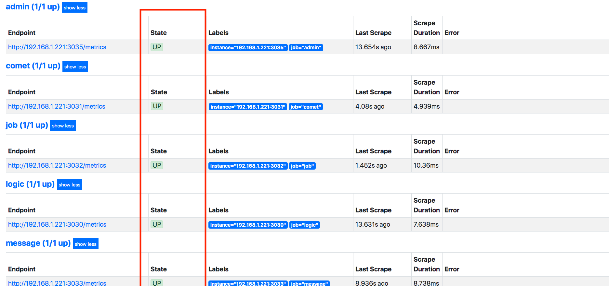
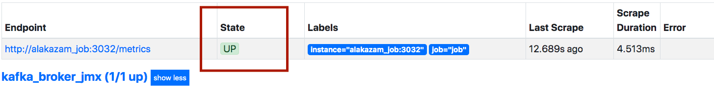
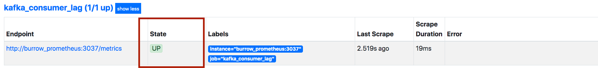
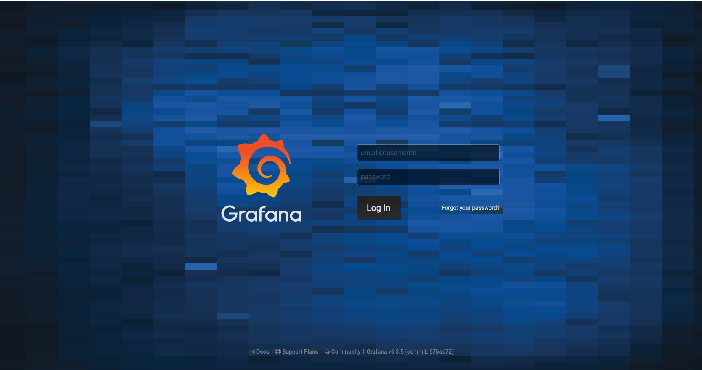

# docker-compose

整合 alakazam 的環境與服務。

- [目錄解說](目錄解說)
- [開始使用](#開始使用)
  - [登入 GitLab Container Registry](#登入 GitLab Container Registry)
  - [Database Migration](#Database Migration)
  - [啟動與停止服務](#啟動與停止服務)
  - [MySQL initdb](#MySQL initdb)
- [Metrics](#Metrics)
  - [prometheus](#prometheus)
  - [kafka broker](#kafka broker)
  - [kafka consumer lag](#kafka consumer lag)
  - [grafana](#grafana)

## 目錄解說

[目錄](https://gitlab.com/jetfueltw/cpw/alakazam/tree/develop/docker/docker-compose)

```bash
.
├── Makefile # 
├── README.md
├── data
├── docker-compose.yml
├── kafka
├── metrics
├── mysql
└── wait-for
```

Makefile

提供關於database `migrate` `rollback` `seed` `reset`指令來操作mysql docker，詳情看Makefile內容


data

mysql與redis位於docker內保存的資料目錄


kafka

存放 kafka docker的資料與jmx設定檔目錄


mysql

存放mysql Dockerfile與初始化sql資料


metrics

[目錄](https://gitlab.com/jetfueltw/cpw/alakazam/tree/develop/docker/docker-compose/metrics)

```bash
├── README.md
├── dashboards
├── doc
├── grafana
├── prometheus
└── prometheus-example.yml
```

dashboards

grafana的dashboard資料


grafana

grafana docker資料位置


prometheus

prometheus docker資料位置


## 開始使用

git clone 到任何你喜歡的位子後，先 `cp .env.example .env` 再更改你需要的設定，例如：
```
MYSQL_ROOT_PASS=root
```


### 登入 GitLab Container Registry

先到 Gitlab 產生一個 [Personal Access Tokens](https://gitlab.com/profile/personal_access_tokens)，name 填 Container Registry（或其他好記的名字），scopes 勾選 read_registry，建立後記得把 token 記起來。  
之後 terminal 輸入 `docker login -u yourname@cqcp.com.tw registry.gitlab.com`，密碼則是剛才產生的 token。


### Database Migration

絕大多數的服務都依賴於資料庫，與正確的 schema 版本，在開始開發前，你需要先初始化資料庫。  
第一次會預設建立 `platform`、`alakazam` 兩個資料庫，如果你在 .env 使用其他名字的話，你必須手動新增資料庫再跑 migrate。
```
// 撤銷所有 migration
make platform.rollback

// 跑還沒跑過的 migration
make platform.migrate

// 塞入預設的必要與測試資料
make platform.seed

// 重設整個資料庫，等同於：rollback + migration + seed
make platform.reset
```


### 啟動與停止服務

請指定你要啟動的服務，不然會全部啟動，可以配合 alias 節省打字時間。

```
// 啟動 alakazam，他會自動把依賴的服務也跑起來
docker-compose up -d alakazam

// 停止所有服務
docker-compose down
```


### MySQL initdb

當第一次啟動 MySQL 時，會執行 `docker-entrypoint-initdb.d` 資料夾底下的 `.sh`、`.sql` 與 `.sql.gz`，你可以在裡面放初始化資料庫的語法。第一次啟動會跑一段時間才能訪問。  
如果你想刪除所有資料庫並重跑 init，可以刪除 volume 後再啟動。

```
docker-compose down
rm -rf ./data/mysql
docker-compose up -d mysql
```


## Metrics

設定各個服務的metrics入口


### prometheus

1. 先copy prometheus-example.yml 

```bash
$ cd metrics
$ cp prometheus-example.yml prometheus.yml
```

2. 設定prometheus.yml內所有job targets，請自行更改targets指向各個服務

```yml
scrape_configs:
  - job_name: 'logic'
    static_configs:
      - targets: ['alakazam_logic:3030']

  - job_name: 'comet'
    static_configs:
      - targets: ['alakazam:3031']

  - job_name: 'job'
    static_configs:
      - targets: ['alakazam_job:3032']

  - job_name: 'message'
    static_configs:
      - targets: ['alakazam_message:3033']

  - job_name: 'seq'
    static_configs:
      - targets: ['alakazam_seq:3034']

  - job_name: 'admin'
    static_configs:
      - targets: ['alakazam_admin:3035']

  - job_name: 'kafka_broker_jmx'
    static_configs:
      - targets: ['kafka:3036']

  - job_name: 'kafka_consumer_lag'
    static_configs:
      - targets: ['burrow_prometheus:3037']
```

| 服務               | metrics port                                                 |
| ------------------ | ------------------------------------------------------------ |
| logic              | https://gitlab.com/jetfueltw/cpw/alakazam/blob/develop/config/logic-example.yml#L89 |
| comet              | https://gitlab.com/jetfueltw/cpw/alakazam/blob/develop/config/comet-example.yml#L39 |
| job                | https://gitlab.com/jetfueltw/cpw/alakazam/blob/develop/config/job-example.yml#L26 |
| message            | https://gitlab.com/jetfueltw/cpw/alakazam/blob/develop/config/message-example.yml#L51 |
| seq                | https://gitlab.com/jetfueltw/cpw/alakazam/blob/develop/config/seq-example.yml#L48 |
| admin              | https://gitlab.com/jetfueltw/cpw/alakazam/blob/develop/config/admin-example.yml#L70 |
| Kafka broker       | https://gitlab.com/jetfueltw/cpw/alakazam/blob/develop/docker/docker-compose/docker-compose.yml#L250 |
| kafka consumer lag | https://gitlab.com/jetfueltw/cpw/alakazam/blob/develop/docker/docker-compose/metrics/burrow/prometheus/main.go#L24 |

3. 啟動 prometheus，打開`127.0.0.1:9090`確認聊天室各個服務狀態是否正常

   ```bash
   $ docker-compose up -d prometheus
   ```

   


### kafka broker

kafka server 確認是否正常啟動




### kafka consumer lag

1. 啟動kafka message consumer lag狀態並確認是否正常

```bash
$ docker-compose up -d burrow_prometheus    
```

2. 確認kafka consumer lag狀態是否正常




### grafana

打開`127.0.0.1:3000`瀏覽器確認grafana狀況，[dashboards](https://gitlab.com/jetfueltw/cpw/alakazam/tree/develop/docker/docker-compose/metrics/dashboards) 目錄有多個監控dashboard可以匯入`grafana`


