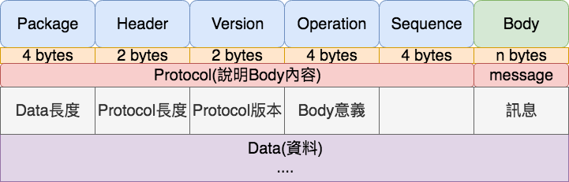

# 紀錄研究資料

## Protocol Body格式

name | length | remork |說明
-----|--------|--------|-----
Package Length|4 bytes|header + body length| 整個Protocol bytes長度
Header Length|2 bytes|protocol header length| Package Length - Boyd Length
Protocol Version|2 bytes|自訂數字|Protocol版本號
Operation|4 bytes| [Operation](#operation)|Protocol的動作
Sequence id |4 bytes| 區分同user但不同裝置連接
Body |不固定|傳送的資料16bytes之後就是Body

## Operation
用來標示該Protocol的動作

name | 說明 |
-----|-----|
2    | 發送心跳 `heartbeat`
3    | service回覆心跳結果 `heartbeat reply`
7    | client要連接到某個room `auth connect`
8    | client連接room後的結果 `auth connect reply`
9    | 回覆給webSocket的內容 `batch message for websocket`

## 連接房間

1. 連接webSocket ws://127.0.0.1:3102/sub
2. 請求連線到某個room，webScoket傳送如下格式binary body bytes

    |key|value|說明|
    |---|-----|----|
    |mid|123|要連接的user id，通常用於指定私密的對象
    |room_id|live://1000|live代表房間種類(自訂)，1000代表房間代號(自訂)
    |platform|web/android/ios|站台種類
    |accepts|[1000,1001,1002]|多房間推送用的tag

    假如有兩個房間如以下資料

    `room1`

    |key|value|
    |---|-----|
    |room_id|live://1000
    |platform|web
    |accepts|[1500,1000]

    `room2`

    |key|value|
    |---|-----|
    |room_id|live://1001
    |platform|web
    |accepts|[1500,1001]

    推送可以指定`operation=1500`就推送到`room1` `room2`

3. service回覆是否進入房間成功

## HTTP 推送
### 情境
    假定有三個會員分別在兩個房間中

    user id
    - 1
    - 2
    - 3

    room id
    - 1000
    - 2000

    pk10 room
    - user id : 1,2
    - room id : 1000
    - accepts : 1000,1111

    dk28 room
    - user id : 3
    - room id : 2000
    - accepts : 2000,1111

> accepts其實就是operation

### Api

訊息推送

---

#### query string

key|value|說明|
---|-----|----|
mids|123 | 推送的user id
operation|[Operation](#operation)|推送的用意
room|1000|推送的room id 
type|live|房間分類

---

#### POST /goim/push/mids

指定推送給某人

推送參數
- operation=1000
- mids=1

`curl -d 'mid message' http://127.0.0.1:3111/goim/push/mids?operation=1000&mids=1`

`pk10` room下的`user id=1`會收到訊息

> 如果mids=1在多個房間都存在且這些房間都有operation=1000，這樣推這些房間都會看到

---

#### POST /goim/push/room

指定推送給某類別底下某房間的所有人

推送參數
- operation=1000
- type=live
- room=1000

`curl -d 'room message' http://127.0.0.1:3111/goim/push/room?operation=1000&type=live&room=1000`

`pk10` room下所有人都會收到訊息

---

#### POST /goim/push/all

指定推送給某場境下所有的room

推送參數
- operation=1111

`curl -d 'broadcast message' http://127.0.0.1:3111/goim/push/all?operation=1111`

`pk10` and `dk28` room下所有人都會收到訊息

---